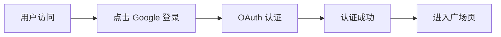

# TWSV｜台股觀點社群 MVP
## Product Requirement Document

---

## 0. 文档说明

### 产品基本信息
- **产品名称**：TWSV
- **产品类型**：台股投资观点评述社群（Threads 风格）
- **开发阶段**：MVP

### 核心设计原则
> 💡 **设计理念**
> - 记录判断，不引导交易
> - 回溯结果，不制造推荐  
> - 建立可信度素材，而非投资暗示
---

## 1. 产品背景与目标

### 1.1 市场背景
> 📈 **现状分析**
> 
> 市场缺乏一个可以把「当下观点」与「未来结果」强制绑定、长期可回溯的平台。

### 1.2 产品目标
TWSV 旨在建立一个**「投资观点记录与回溯平台」**，实现以下功能：

#### 核心功能
- ✅ **可结构化发表投资观点**
- ✅ **可在时间到期或手动结束后自动结算**
- ✅ **可沉淀个人判断历史与长期可信度**

#### ⚠️ 重要声明
> 🔔 **法律声明**  
> 本产品不提供投资建议，不构成任何交易信号。

### 1.3 MVP 验证目标
#### 关键验证点
1. **用户参与度**：用户是否愿意留下可被验证的判断记录
2. **价值闭环**：「观点 × 时间 × 结果」闭环是否有价值
3. **行为影响**：绩效回溯是否促使用户更谨慎表达观点
---

## 2. 产品定位

### 产品定位说明
| 定位类型 | 说明 |
|---------|------|
| ✅ **投资观点记录平台** | 主要功能 |
| ✅ **判断历史档案工具** | 核心价值 |
| ❌ **非选股产品** | 明确排除 |
| ❌ **非投顾产品** | 明确排除 |
| ❌ **非跟单产品** | 明确排除 |
---

## 3. 核心概念定义

### 3.1 观点（View）

#### 定义说明
> 🎯 **View 是平台的最小核心单位**
> 
> 代表：用户在某一时间点，对某一台股标的，做出的方向性判断。

#### 一条 View 必须完整覆盖
| 要素 | 说明 |
|------|------|
| 📊 **判断标的** | 具体台股代码 |
| 📈 **判断方向** | 看多/看空/中性 |
| ⏰ **判断时效** | 5/10/20个交易日 |
| 🕐 **判断开始时间** | 观点发布时间 |
| 🎯 **判断结束与结果** | 自动或手动结算 |
---

## 4. 产品整体架构

### 4.1 页面架构（Page Architecture）

#### 设计理念
> 💫 **Threads 启发的「流式」布局**  
> 强调连续性与可探索性

#### 全局布局与交互约束
- 📐 **容器宽度**：浏览器 100% 宽度自适应，内容最大宽度 600px，支持 RWD。
- 🔎 **输入交互**：点击输入框不触发页面缩放或重定位。

#### 页面结构
| 页面 | 说明 | 功能特性 |
|------|------|----------|
| 🔐 **登录页（Login）** | 仅 Google OAuth | 单一登录方式 |
| 🏠 **广场页（Home / Feed）** | 全站观点信息流 | 主要内容展示 |
| 🔍 **搜索页（Search）** | 股票 / 话题探索 | 发现与检索 |
| 🏷️ **话题详情页（Hashtag Detail）** | 单一话题观点聚合 | 事件/主题讨论 |
| 📊 **个股详情页（Stock Detail）** | 单一股票观点聚合 | 个股观点汇总 |
| 👤 **个人页（Profile）** | 用户历史观点与绩效 | 个人数据中心 |

### 4.2 数据架构（Data Architecture）

#### 核心数据对象
- 🎯 **View（观点）**：核心业务对象

#### 辅助聚合逻辑
| 聚合类型 | 说明 | 用途 |
|----------|------|------|
| 📈 **performance_summary** | 用户绩效汇总 | 个人页面展示 |
| 📊 **asset_view_stats** | 个股维度统计 | 个股详情页 |
| 🏷️ **hashtag_view_stats** | 话题维度统计 | 话题详情页 |
---

## 5. 页面级功能需求

### 5.1 登录页（Login）

#### 功能特性
- 🔑 **单一登录方式**：Google OAuth 登录

#### 登录流程


> 💡 **用户体验设计**：OAuth 成功后直接进入广场页，无需额外设置
### 5.2 广场页（Feed）

#### 5.2.1 发文入口
- 🎨 **设计样式**：Threads「What's new?」风格
- 🔄 **交互方式**：点击后弹出结构化发文弹窗

#### 5.2.2 信息流展示

##### 内容展示策略
| 模式 | 说明 | 排序方式 |
|------|------|----------|
| 🆕 **最新** | 所有 active 观点 | 按时间倒序 |
| 🔥 **推荐（MVP+）** | 基于新鲜度 / 互动 | 非绩效算法 |

> 📝 **信息流设计原则**：强调内容的时效性和互动性，避免过度关注历史收益
### 5.3 搜索页（Search）

#### 5.3.1 搜索规则

##### 支持的搜索类型
| 搜索类型 | 格式规则 | 示例 |
|----------|----------|------|
| 📊 **股票搜索** | 4 位数字（台股代码） | `2330`, `2454` |
| 🏷️ **话题搜索** | # 开头 | `#AI概念股`, `#台積電法說` |

#### 5.3.2 发现流内容

##### 热门内容推荐
| 内容类型 | 推荐逻辑 | 展示方式 |
|----------|----------|----------|
| 🔥 **热门股票** | 当前讨论度最高 | 实时排序 |
| 📈 **热门话题** | 基于观点数量 | 动态更新 |

> 🎯 **发现算法**：基于实时讨论热度和观点数量，动态生成推荐内容
### 5.4 话题详情页（Hashtag Detail）🆕

#### 5.4.1 页面定位

##### 功能定义
> 🏷️ **话题详情页是以 #Hashtag 为单位的观点聚合页**

##### 支持的话题类型
| 类型 | 示例 | 说明 |
|------|------|------|
| 🏢 **事件型讨论** | `#台積電法說` | 针对特定公司事件 |
| 🎯 **主题型讨论** | `#AI概念股` | 行业或概念主题 |
| 📊 **宏观议题** | `#降息預期` | 阶段性情绪或宏观议题 |

> ⚠️ **重要说明**：Hashtag 是「讨论语境」，不是金融分类。

#### 5.4.2 进入方式

##### 多种访问路径
| 方式 | 说明 | 用户行为 |
|------|------|----------|
| 🔗 **观点链接** | 点击观点正文中的 #hashtag | 直接跳转 |
| 🔍 **搜索结果** | 搜索页话题结果 | 主动搜索 |
| 🏆 **热门入口** | 热门话题入口（如有） | 推荐发现 |
#### 5.4.3 页面结构

##### ① 话题信息区
- 📝 **#Hashtag 名称**：话题标识
- 📄 **话题描述**：可为空，话题背景说明
- 📊 **关联观点总数**：该话题下的所有观点数量
- 🟢 **当前 active 观点数**：正在进行的观点数量

##### ② 话题概览（可选）
- 📈 **关联股票数量**：涉及的不同股票数量
- ⚖️ **观点比例分布**：
  - 🟢 **多头观点比例**
  - 🔴 **空头观点比例** 
  - ⚪ **中性观点比例**
  > 统计范围：跨所有标的的汇总

> ⚠️ **显示限制**：不显示收益、不显示胜率

##### ③ 观点流展示
| 视图模式 | 说明 | 排序逻辑 |
|----------|------|----------|
| 🆕 **最新** | 最新发布的观点 | 时间倒序 |
| 🟢 **Active** | 未结算观点 | 时间倒序 |
| ✅ **已结算** | 已结束观点 | 时间倒序 |
#### 5.4.4 话题页与个股页的功能边界

##### 功能对比表
| 功能项目 | 个股详情页 | 话题详情页 |
|----------|------------|------------|
| 📊 **是否绑定行情** | ✅ 是 | ❌ 否 |
| 💰 **是否有起始价** | ✅ 有 | ❌ 无 |
| 🔗 **聚合逻辑** | asset_code | hashtag |
| 📈 **实时数据** | 连接股价数据 | 纯观点聚合 |
| ⏰ **时效性** | 实时更新 | 静态聚合 |
### 5.5 个股详情页（Stock Detail）

#### 页面内容结构

##### ① 股票基础信息
- 📊 **当前 active 观点数**：该股票正在进行的观点数量
- 📈 **观点分布比例**：
  - 🟢 **看多比例**
  - 🔴 **看空比例**
  - ⚪ **中性比例**

##### ② 历史观点列表
- 📋 **观点历史**：按时间排序的观点记录
- 🕒 **时间序列**：展示观点发布的时间线

> ⚠️ **展示规则**：
> - ❌ **不显示预测价格**
> - ❌ **不按收益排序**
> - ✅ **强调时间序列和观点质量**
### 5.6 个人页（Profile）

#### 页面结构设计

##### ① 用户基础信息
- 👤 **用户名**：用户昵称或显示名称
- 📅 **注册时间**：用户加入平台的时间

##### ② 绩效卡片（仅展示）
> 📊 **个人绩效概览**

| 绩效指标 | 说明 | 计算方式 |
|----------|------|----------|
| 📈 **累计报酬率** | 总体投资观点表现 | 所有已结算观点的平均收益率 |
| 🎯 **预测胜率** | 方向正确率 | 方向判断正确的观点占比 |

##### ③ 个人观点列表
| 状态分类 | 说明 | 展示方式 |
|----------|------|----------|
| 🟢 **Active** | 正在进行的观点 | 实时更新状态 |
| ✅ **Closed** | 已结算的观点 | 显示结算结果 |

> ⚠️ **隐私保护原则**：不做用户间横向比较，保护用户隐私
---

## 6. 核心功能逻辑

### 6.1 发表观点（Create View）

#### 用户输入（必填项）
| 字段 | 说明 | 输入类型 |
|------|------|----------|
| 📊 **股票** | 台股代码 + 名称 | 选择/搜索 |
| 📈 **方向** | 看多 / 看空 / 中性 | 单选 |
| ⏰ **时效** | 5 / 10 / 20 交易日 | 单选 |
| 📝 **内容** | 自由文字 | 文本框 |
| 🏷️ **Hashtag** | 可选，支持多个 | 多选/自定义 |

#### 系统自动生成
| 系统字段 | 说明 | 生成方式 |
|----------|------|----------|
| 🕐 **发文时间** | 观点发布时间 | 自动记录 |
| 💰 **起始价格** | 当日收盘价 | 自动获取 |
| 🟢 **状态** | active | 默认设置 |

### 6.2 观点结束与结算

#### 6.2.1 结束方式
| 结束类型 | 说明 | 触发条件 |
|----------|------|----------|
| 👤 **手动结束** | 用户主动结束 | 用户操作 |
| ⏰ **系统到期** | 时间到达自动结束 | 时间触发 |

#### 6.2.2 结束类型分类
| 类型标识 | 说明 | 场景 |
|----------|------|------|
| 📝 **manual_early** | 提前手动结束 | 用户提前关闭 |
| ⏰ **manual_on_time** | 按时手动结束 | 用户按时关闭 |
| ⏰ **manual_late** | 延迟手动结束 | 用户延迟关闭 |
| 🤖 **auto_expired** | 系统到期结束 | 时间自动到期 |

#### 6.2.3 结算公式
> 📊 **收益率计算公式**  
> 
> `return_pct = (end_price - start_price) / start_price`
---

## 7. 数据表设计（MVP）

### 7.1 View（观点表）

#### 字段设计
| 字段名 | 数据类型 | 说明 | 约束 |
|--------|----------|------|------|
| `view_id` | VARCHAR(36) | 观点唯一 ID | PRIMARY KEY |
| `user_id` | VARCHAR(36) | 用户 ID | FOREIGN KEY |
| `asset_code` | VARCHAR(10) | 股票代码 | NOT NULL |
| `direction` | ENUM | 方向 | long/short/neutral |
| `time_horizon` | INT | 时效 | 5/10/20 |
| `start_time` | DATETIME | 发文时间 | NOT NULL |
| `start_price` | DECIMAL | 起始价 | NOT NULL |
| `end_time` | DATETIME | 结束时间 | NULL |
| `end_price` | DECIMAL | 结算价 | NULL |
| `end_type` | ENUM | 结束方式 | 见 6.2.2 |
| `return_pct` | DECIMAL | 涨跌幅 | 计算字段 |
| `status` | ENUM | 状态 | active/closed |
| `content` | TEXT | 观点内容 | NOT NULL |
| `hashtags` | JSON | 话题标签 | 数组格式 |
| `created_at` | DATETIME | 创建时间 | DEFAULT NOW() |
| `updated_at` | DATETIME | 更新时间 | AUTO UPDATE |

### 7.2 User（用户表）

#### 字段设计
| 字段名 | 数据类型 | 说明 | 约束 |
|--------|----------|------|------|
| `user_id` | VARCHAR(36) | 用户唯一 ID | PRIMARY KEY |
| `oauth_provider` | VARCHAR(30) | OAuth 提供方（如 google） | NOT NULL |
| `oauth_sub` | VARCHAR(100) | OAuth 用户唯一标识（sub） | NOT NULL |
| `username` | VARCHAR(50) | 用户名 | UNIQUE |
| `email` | VARCHAR(100) | 邮箱 | UNIQUE |
| `avatar_url` | VARCHAR(255) | 头像链接 | NULL |
| `created_at` | DATETIME | 创建时间 | DEFAULT NOW() |
| `updated_at` | DATETIME | 更新时间 | AUTO UPDATE |

### 7.3 Asset（股票表）

#### 字段设计
| 字段名 | 数据类型 | 说明 | 约束 |
|--------|----------|------|------|
| `asset_code` | VARCHAR(10) | 股票代码 | PRIMARY KEY |
| `name` | VARCHAR(100) | 股票名称 | NOT NULL |
| `market` | VARCHAR(20) | 市场 | NOT NULL |
| `last_price` | DECIMAL | 最新价格 | NULL |
| `updated_at` | DATETIME | 更新时间 | AUTO UPDATE |

### 7.4 索引设计

#### 性能优化索引
| 索引类型 | 字段 | 用途 |
|----------|------|------|
| 🔍 **搜索索引** | asset_code, hashtags | 搜索优化 |
| 📊 **统计索引** | status, direction | 聚合查询 |
| ⏰ **时间索引** | start_time, end_time | 时间排序 |
| 👤 **用户索引** | user_id | 用户查询 |

---

## 7.5 API 设计（MVP）

> 🎯 **目标**：围绕 OAuth 登录、用户信息校验、观点发布与信息流读取建立最小可用接口。

### 7.5.1 认证与用户
| 方法 | 路径 | 说明 | 认证 |
|------|------|------|------|
| `POST` | `/auth/google` | OAuth code 换取 JWT 与用户信息 | 否 |
| `GET` | `/me` | 查询当前登录用户信息 | ✅ Bearer |

**`POST /auth/google` 请求体**
```json
{ "code": "google_oauth_code" }
```

**`POST /auth/google` 响应**
```json
{
  "token": "jwt",
  "user": {
    "user_id": "uuid",
    "username": "display_name",
    "email": "user@example.com",
    "avatar_url": "https://..."
  }
}
```

### 7.5.2 观点（Feed）
| 方法 | 路径 | 说明 | 认证 |
|------|------|------|------|
| `GET` | `/views` | 获取观点信息流（支持分页/筛选） | 否 |
| `GET` | `/views?user_id=...` | 获取某用户观点列表 | 否 |
| `POST` | `/views` | 发布观点 | ✅ Bearer |

**`POST /views` 请求体（简化版）**
```json
{
  "asset_code": "2330",
  "direction": "long",
  "time_horizon": 10,
  "content": "短期看多台积电",
  "hashtags": ["#AI概念股"]
}
```

**`POST /views` 响应**
```json
{
  "view_id": "uuid",
  "status": "active",
  "created_at": "2024-01-01T00:00:00Z"
}
```

## 8. 项目实施计划

### 8.1 开发阶段规划

#### MVP 核心功能优先级
| 优先级 | 功能模块 | 预计工期 | 关键里程碑 |
|--------|----------|----------|------------|
| 🔥 **P0** | 用户认证系统 | 1周 | Google OAuth 集成 |
| 🔥 **P0** | 观点发布功能 | 2周 | 结构化发文界面 |
| 🔥 **P0** | 观点展示与搜索 | 2周 | 信息流展示 |
| 🟡 **P1** | 观点结算系统 | 2周 | 自动/手动结算 |
| 🟡 **P1** | 个人页面 | 1周 | 绩效展示 |
| 🔵 **P2** | 话题详情页 | 1周 | Hashtag 聚合 |

### 8.2 技术栈建议

#### 前端技术
- **框架**：React / Vue.js
- **UI 组件库**：Tailwind CSS / Ant Design
- **状态管理**：Redux / Vuex
- **HTTP 客户端**：Axios

#### 后端技术
- **运行环境**：Node.js / Python
- **Web 框架**：Express / FastAPI
- **数据库**：PostgreSQL / MySQL
- **缓存**：Redis

#### 第三方服务
- **认证**：Google OAuth 2.0
- **股票数据**：台股实时行情 API
- **文件存储**：AWS S3 / Cloud Storage

---

## 9. 风险评估与应对策略

### 9.1 技术风险
| 风险类型 | 风险描述 | 应对策略 |
|----------|----------|----------|
| 📊 **数据准确性** | 股价数据延迟或错误 | 多数据源备份，实时监控 |
| 🔒 **用户隐私** | 个人信息泄露风险 | 加密存储，权限控制 |
| ⚡ **性能瓶颈** | 高并发下的系统性能 | 缓存策略，数据库优化 |

### 9.2 业务风险
| 风险类型 | 风险描述 | 应对策略 |
|----------|----------|----------|
| ⚖️ **合规风险** | 投资建议相关法律风险 | 明确免责声明，限制功能 |
| 👥 **用户接受度** | 用户参与度低于预期 | 用户调研，快速迭代 |
| 💰 **盈利模式** | MVP 阶段缺乏盈利点 | 后期功能扩展，增值服务 |

---

## 10. 成功指标与监控

### 10.1 关键成功指标（KPI）

#### 用户参与度指标
- 📈 **日活跃用户数（DAU）**：目标 1000+
- 💬 **观点发布数量**：目标日均 50+
- 🔄 **用户留存率**：7日留存 > 30%

#### 内容质量指标
- ✅ **观点完成率**：> 80%（观点被结算）
- 🎯 **用户满意度**：评分 > 4.0/5.0
- 🔍 **搜索使用率**：> 60% 用户使用搜索功能

### 10.2 监控与反馈机制
- 📊 **实时数据监控**：用户行为追踪
- 🔔 **异常告警系统**：系统故障及时响应
- 📱 **用户反馈渠道**：APP 内反馈，客服支持

---

## 11. 总结

### 11.1 产品核心价值
TWSV 作为台股投资观点记录与回溯平台，通过结构化的观点发布和强制性的结果绑定，为用户提供：
- 🎯 **可验证的判断记录**
- 📊 **长期可信度沉淀**
- ⚖️ **客观的绩效回溯**

### 11.2 MVP 成功要素
1. **简洁的用户体验**：单一点登录，流畅的发文流程
2. **强制性的结果绑定**：每个观点都有明确的结束时间和结果
3. **透明的数据展示**：不隐藏失败，强调学习和改进

### 11.3 未来发展方向
- **功能扩展**：高级分析工具，用户间互动功能
- **数据挖掘**：市场情绪分析，趋势预测
- **社区建设**：KOL 机制，优质内容推荐

---

*文档版本：v1.0*  
*最后更新：2024年*  
*负责人：产品团队*
